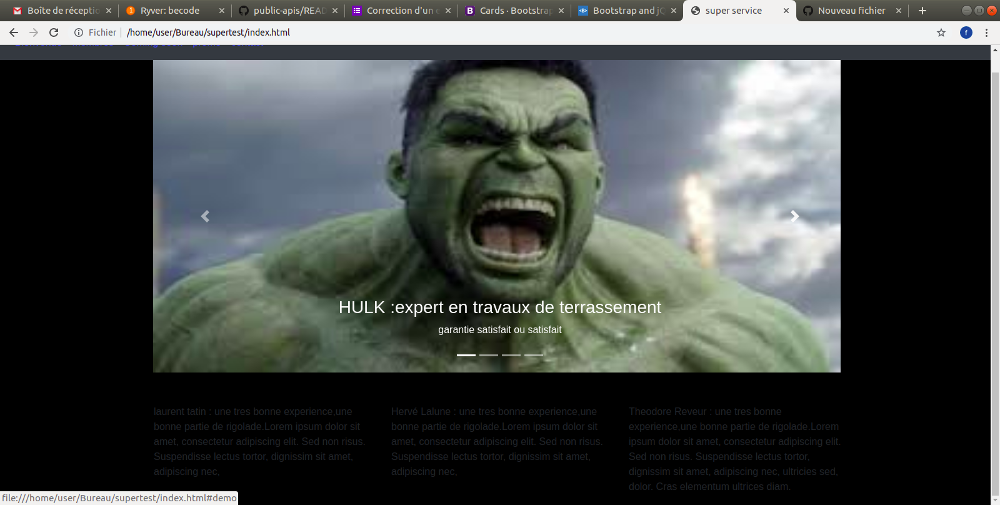

# bootstrap-css-framework

# utilisation bootstrap /responsive
exercice
## creation start up fictive 
5 pages

 github page : [Démo](https://freddymatime.github.io/bootstrap-css-framework/membre.html

image :marvel et dc
